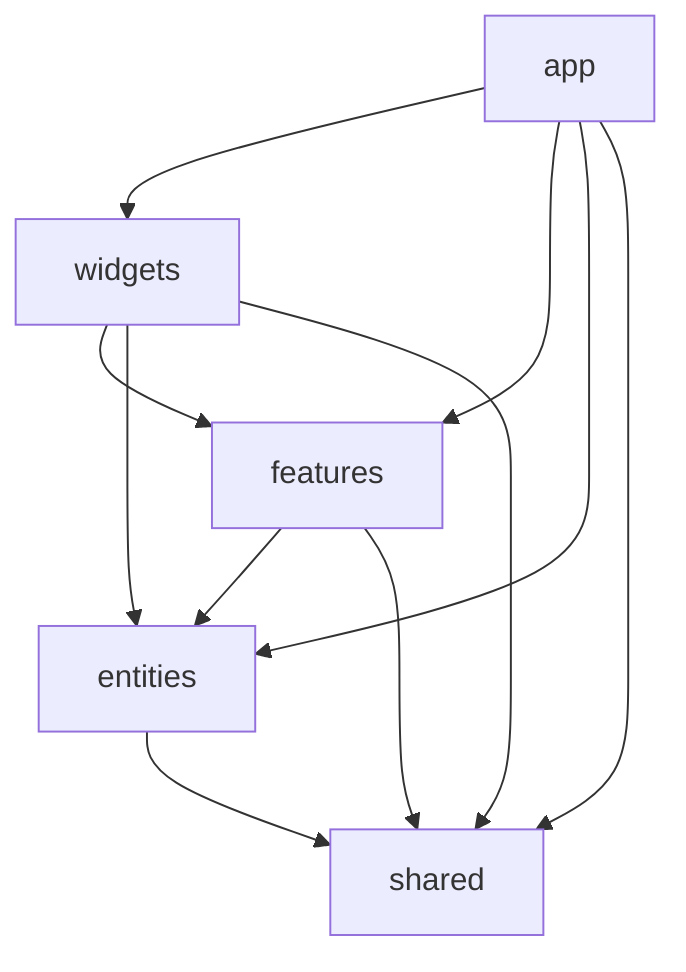

# 다온(Daon) 기술 가이드 & Best Practices

## 📋 목차
1. [아키텍처 심화 가이드](#아키텍처-심화-가이드)
2. [성능 최적화 전략](#성능-최적화-전략)
3. [보안 구현 가이드](#보안-구현-가이드)
4. [테스트 전략](#테스트-전략)
5. [배포 및 CI/CD](#배포-및-cicd)
6. [모니터링 및 로깅](#모니터링-및-로깅)
7. [확장성 고려사항](#확장성-고려사항)

---

## 🏗 아키텍처 심화 가이드

### Feature-Sliced Design (FSD) 심화

#### 레이어별 역할과 책임

```
📁 apps/mobile/
├── 📁 app/                    # Expo Router (라우팅 레이어)
│   ├── 📁 (tabs)/            # 탭 네비게이션
│   ├── 📁 (auth)/            # 인증 그룹
│   ├── 📁 (onboarding)/      # 온보딩 그룹
│   └── 📁 [dynamic]/         # 동적 라우팅
├── 📁 pages/                  # 페이지 컴포지션 (사용하지 않음, Expo Router 사용)
├── 📁 widgets/                # 위젯 레이어
│   ├── 📁 ChildSelector/      # 아이 선택 위젯
│   ├── 📁 QuickActions/       # 빠른 액션 위젯
│   └── 📁 ActivitySummary/    # 활동 요약 위젯
├── 📁 features/               # 피처 레이어
│   ├── 📁 auth/              # 인증 관련 피처
│   ├── 📁 activities/        # 활동 기록 피처
│   ├── 📁 diary/             # 일기 피처
│   ├── 📁 growth/            # 성장 기록 피처
│   └── 📁 children/          # 아이 관리 피처
├── 📁 entities/               # 엔티티 레이어
│   ├── 📁 activity/          # 활동 도메인
│   ├── 📁 child/             # 아이 도메인
│   ├── 📁 diary-entry/       # 일기 도메인
│   └── 📁 growth-record/     # 성장 기록 도메인
└── 📁 shared/                 # 공유 레이어
    ├── 📁 api/               # API 관련
    ├── 📁 ui/                # UI 컴포넌트
    ├── 📁 lib/               # 유틸리티
    ├── 📁 hooks/             # 커스텀 훅
    ├── 📁 store/             # 상태 관리
    ├── 📁 config/            # 설정
    └── 📁 constants/         # 상수
```

#### 의존성 규칙 (Dependency Rule)



**절대 위반하면 안 되는 규칙**:
- 상위 레이어는 하위 레이어를 import 할 수 있음
- 하위 레이어는 상위 레이어를 import 할 수 없음
- 같은 레이어 내에서는 서로 import 금지 (shared 제외)

#### Public API 패턴

각 슬라이스는 `index.ts`를 통해 Public API를 노출:

```typescript
// features/auth/index.ts
export { SignInForm } from './ui/SignInForm';
export { SignUpForm } from './ui/SignUpForm';
export { useAuth } from './model/useAuth';
export type { AuthState } from './model/types';

// 사용하는 곳에서
import { SignInForm, useAuth } from '@/features/auth';
```

### 상태 관리 아키텍처

#### 서버 상태 vs 클라이언트 상태

```typescript
// 서버 상태 - TanStack Query
const { data: activities } = useActivities({
  childId: activeChild?.id,
  limit: 20,
  offset: 0
});

// 클라이언트 상태 - Zustand
const useActiveChild = create<ActiveChildState>((set) => ({
  activeChild: null,
  setActiveChild: (child) => set({ activeChild: child }),
  switchChild: (childId) => {
    // 복잡한 로직...
  }
}));
```

#### 상태 동기화 전략

```typescript
// 낙관적 업데이트 패턴
export function useCreateActivity() {
  const queryClient = useQueryClient();
  
  return useMutation({
    mutationFn: createActivity,
    onMutate: async (newActivity) => {
      // 1. 진행 중인 쿼리 취소
      await queryClient.cancelQueries({ 
        queryKey: ACTIVITIES_KEYS.lists() 
      });
      
      // 2. 현재 데이터 백업
      const previousActivities = queryClient.getQueryData(
        ACTIVITIES_KEYS.list({ childId: newActivity.childId })
      );
      
      // 3. 낙관적 업데이트
      queryClient.setQueryData(
        ACTIVITIES_KEYS.list({ childId: newActivity.childId }),
        (old: any) => ({
          ...old,
          activities: [newActivity, ...old.activities]
        })
      );
      
      return { previousActivities };
    },
    onError: (err, newActivity, context) => {
      // 4. 에러 시 롤백
      queryClient.setQueryData(
        ACTIVITIES_KEYS.list({ childId: newActivity.childId }),
        context?.previousActivities
      );
    },
    onSettled: () => {
      // 5. 최종적으로 서버 데이터로 동기화
      queryClient.invalidateQueries({ 
        queryKey: ACTIVITIES_KEYS.lists() 
      });
    }
  });
}
```

---

## ⚡ 성능 최적화 전략

### React Native 성능 최적화

#### 1. 리스트 최적화

```typescript
// FlatList 최적화
const ActivityList = ({ activities }: ActivityListProps) => {
  const renderActivity = useCallback(({ item }: { item: ActivityApi }) => (
    <ActivityCard activity={item} />
  ), []);
  
  const keyExtractor = useCallback((item: ActivityApi) => item.id, []);
  
  return (
    <FlatList
      data={activities}
      renderItem={renderActivity}
      keyExtractor={keyExtractor}
      // 성능 최적화 옵션
      removeClippedSubviews={true}
      maxToRenderPerBatch={10}
      updateCellsBatchingPeriod={50}
      initialNumToRender={10}
      windowSize={10}
      getItemLayout={(data, index) => ({
        length: ITEM_HEIGHT,
        offset: ITEM_HEIGHT * index,
        index,
      })}
    />
  );
};
```

#### 2. 이미지 최적화

```typescript
// 이미지 로딩 최적화
import { Image } from 'expo-image';

const OptimizedImage = ({ uri, width, height }: ImageProps) => (
  <Image
    source={{ uri }}
    style={{ width, height }}
    contentFit="cover"
    placeholder={blurhash}
    transition={200}
    // 캐싱 전략
    cachePolicy="memory-disk"
    // 우선순위
    priority="high"
  />
);
```

#### 3. 메모이제이션 전략

```typescript
// 컴포넌트 메모이제이션
const ActivityCard = React.memo(({ activity }: ActivityCardProps) => {
  // ... 컴포넌트 로직
}, (prevProps, nextProps) => {
  // 커스텀 비교 함수
  return prevProps.activity.id === nextProps.activity.id &&
         prevProps.activity.updatedAt === nextProps.activity.updatedAt;
});

// 값 메모이제이션
const ExpensiveComponent = () => {
  const expensiveValue = useMemo(() => {
    return heavyCalculation(data);
  }, [data]);
  
  const memoizedCallback = useCallback((id: string) => {
    onItemPress(id);
  }, [onItemPress]);
  
  return <View>{/* ... */}</View>;
};
```

### 번들 크기 최적화

#### 1. 동적 임포트

```typescript
// 큰 라이브러리 동적 로딩
const LazyChartComponent = React.lazy(() => 
  import('./ChartComponent').then(module => ({
    default: module.ChartComponent
  }))
);

// 사용법
const AnalyticsScreen = () => (
  <Suspense fallback={<LoadingSpinner />}>
    <LazyChartComponent data={chartData} />
  </Suspense>
);
```

#### 2. 트리 쉐이킹 최적화

```typescript
// ❌ 전체 라이브러리 임포트
import * as icons from '@expo/vector-icons';

// ✅ 필요한 것만 임포트
import { Ionicons } from '@expo/vector-icons';
import { format } from 'date-fns/format';
import { ko } from 'date-fns/locale/ko';
```

---

## 🔐 보안 구현 가이드

### 인증 및 권한 관리

#### JWT 토큰 보안

```typescript
// 토큰 저장 및 관리
import * as SecureStore from 'expo-secure-store';

class TokenManager {
  private static readonly ACCESS_TOKEN_KEY = 'access_token';
  private static readonly REFRESH_TOKEN_KEY = 'refresh_token';
  
  static async saveTokens(accessToken: string, refreshToken: string) {
    await Promise.all([
      SecureStore.setItemAsync(this.ACCESS_TOKEN_KEY, accessToken),
      SecureStore.setItemAsync(this.REFRESH_TOKEN_KEY, refreshToken)
    ]);
  }
  
  static async getAccessToken(): Promise<string | null> {
    return await SecureStore.getItemAsync(this.ACCESS_TOKEN_KEY);
  }
  
  static async clearTokens() {
    await Promise.all([
      SecureStore.deleteItemAsync(this.ACCESS_TOKEN_KEY),
      SecureStore.deleteItemAsync(this.REFRESH_TOKEN_KEY)
    ]);
  }
}
```

#### API 보안

```typescript
// API 클라이언트 보안 설정
const apiClient = axios.create({
  baseURL: process.env.EXPO_PUBLIC_API_URL,
  timeout: 10000,
  headers: {
    'Content-Type': 'application/json',
  },
});

// 요청 인터셉터 - 토큰 주입
apiClient.interceptors.request.use(async (config) => {
  const token = await TokenManager.getAccessToken();
  if (token) {
    config.headers.Authorization = `Bearer ${token}`;
  }
  
  // API 키 검증 (선택사항)
  config.headers['X-API-Key'] = process.env.EXPO_PUBLIC_API_KEY;
  
  return config;
});

// 응답 인터셉터 - 토큰 갱신
apiClient.interceptors.response.use(
  (response) => response,
  async (error) => {
    if (error.response?.status === 401) {
      try {
        await refreshAccessToken();
        // 원본 요청 재시도
        return apiClient.request(error.config);
      } catch (refreshError) {
        // 리프레시 실패 시 로그아웃
        await TokenManager.clearTokens();
        // 로그인 화면으로 리다이렉트
        router.replace('/sign-in');
      }
    }
    return Promise.reject(error);
  }
);
```

### 데이터 검증 및 정제

#### Zod 스키마 보안 패턴

```typescript
// 보안이 강화된 스키마
export const CreateActivityRequestSchema = z.object({
  childId: z.uuid("유효하지 않은 아이 ID"),
  type: z.enum(["feeding", "diaper", "sleep", "tummy_time", "custom"]),
  timestamp: z.string().datetime("유효하지 않은 날짜"),
  data: z.record(z.unknown()).refine((data) => {
    // 데이터 크기 제한
    const serialized = JSON.stringify(data);
    return serialized.length <= 10000; // 10KB 제한
  }, "데이터가 너무 큽니다"),
  notes: z.string()
    .max(1000, "메모는 1000자 이하여야 합니다")
    .transform((str) => str.trim()) // 공백 제거
    .refine((str) => !containsProfanity(str), "부적절한 내용이 포함되어 있습니다")
    .optional(),
});

// 프로파일 이미지 업로드 스키마
export const ImageUploadSchema = z.object({
  uri: z.string().url("유효하지 않은 이미지 URL"),
  type: z.enum(["image/jpeg", "image/png", "image/webp"]),
  size: z.number().max(10 * 1024 * 1024, "이미지 크기는 10MB 이하여야 합니다"),
});
```

---

## 🧪 테스트 전략

### 테스트 피라미드

```
    🔺 E2E Tests (5%)
   🔺🔺 Integration Tests (15%)
🔺🔺🔺🔺 Unit Tests (80%)
```

#### 1. 단위 테스트 (Unit Tests)

```typescript
// utils/dateHelper.test.ts
import { formatActivityTime, calculateAge } from '../dateHelper';

describe('dateHelper', () => {
  describe('formatActivityTime', () => {
    it('should format time correctly for today', () => {
      const now = new Date();
      const result = formatActivityTime(now.toISOString());
      expect(result).toMatch(/^오늘 \d{2}:\d{2}$/);
    });
    
    it('should format time correctly for yesterday', () => {
      const yesterday = new Date();
      yesterday.setDate(yesterday.getDate() - 1);
      const result = formatActivityTime(yesterday.toISOString());
      expect(result).toMatch(/^어제 \d{2}:\d{2}$/);
    });
  });
  
  describe('calculateAge', () => {
    it('should calculate age in days for newborn', () => {
      const birthDate = new Date();
      birthDate.setDate(birthDate.getDate() - 15);
      const age = calculateAge(new Date().toISOString(), birthDate.toISOString());
      expect(age).toBe('15일');
    });
  });
});
```

#### 2. 컴포넌트 테스트

```typescript
// components/ActivityCard.test.tsx
import { render, fireEvent } from '@testing-library/react-native';
import { ActivityCard } from '../ActivityCard';
import { mockActivity } from '../../__mocks__/activities';

describe('ActivityCard', () => {
  it('should render activity information correctly', () => {
    const { getByText } = render(
      <ActivityCard activity={mockActivity} />
    );
    
    expect(getByText('수유')).toBeTruthy();
    expect(getByText('150ml')).toBeTruthy();
  });
  
  it('should call onPress when pressed', () => {
    const onPressMock = jest.fn();
    const { getByTestId } = render(
      <ActivityCard 
        activity={mockActivity} 
        onPress={onPressMock}
      />
    );
    
    fireEvent.press(getByTestId('activity-card'));
    expect(onPressMock).toHaveBeenCalledWith(mockActivity);
  });
});
```

#### 3. API 테스트

```typescript
// api/activities.test.ts
import { createActivity } from '../activities';
import { mockApiClient } from '../../__mocks__/apiClient';

jest.mock('../client');

describe('activities API', () => {
  it('should create activity successfully', async () => {
    const mockActivity = { /* ... */ };
    mockApiClient.post.mockResolvedValue({ 
      data: { activity: mockActivity } 
    });
    
    const result = await createActivity(mockActivity);
    
    expect(mockApiClient.post).toHaveBeenCalledWith(
      '/activities',
      mockActivity
    );
    expect(result).toEqual({ activity: mockActivity });
  });
});
```

#### 4. E2E 테스트 (Detox)

```typescript
// e2e/auth.test.ts
describe('Authentication Flow', () => {
  beforeEach(async () => {
    await device.reloadReactNative();
  });
  
  it('should complete sign in flow', async () => {
    // 로그인 화면 확인
    await expect(element(by.id('sign-in-screen'))).toBeVisible();
    
    // 이메일 입력
    await element(by.id('email-input')).typeText('test@example.com');
    
    // 비밀번호 입력
    await element(by.id('password-input')).typeText('password123');
    
    // 로그인 버튼 탭
    await element(by.id('sign-in-button')).tap();
    
    // 홈 화면으로 이동 확인
    await expect(element(by.id('home-screen'))).toBeVisible();
  });
});
```

---

## 🚀 배포 및 CI/CD

### EAS Build 설정

#### 1. eas.json 최적화

```json
{
  "cli": {
    "version": ">= 3.0.0"
  },
  "build": {
    "development": {
      "developmentClient": true,
      "distribution": "internal",
      "ios": {
        "buildConfiguration": "Debug"
      },
      "android": {
        "buildType": "apk",
        "gradleCommand": ":app:assembleDebug"
      }
    },
    "preview": {
      "distribution": "internal",
      "ios": {
        "buildConfiguration": "Release",
        "bundleIdentifier": "com.daon.app.preview"
      },
      "android": {
        "buildType": "apk",
        "gradleCommand": ":app:assembleRelease"
      }
    },
    "production": {
      "ios": {
        "buildConfiguration": "Release"
      },
      "android": {
        "buildType": "aab",
        "gradleCommand": ":app:bundleRelease"
      }
    }
  },
  "submit": {
    "production": {
      "ios": {
        "appleId": "your.apple.id@email.com",
        "ascAppId": "1234567890",
        "appleTeamId": "ABCDEF1234"
      },
      "android": {
        "serviceAccountKeyPath": "./service-account-key.json",
        "track": "production"
      }
    }
  }
}
```

#### 2. GitHub Actions 워크플로우

```yaml
# .github/workflows/build.yml
name: Build and Deploy

on:
  push:
    branches: [main, develop]
  pull_request:
    branches: [main]

jobs:
  test:
    runs-on: ubuntu-latest
    steps:
      - uses: actions/checkout@v3
      
      - name: Setup Node.js
        uses: actions/setup-node@v3
        with:
          node-version: '18'
          cache: 'pnpm'
      
      - name: Install dependencies
        run: pnpm install --frozen-lockfile
      
      - name: Run type check
        run: pnpm type-check
      
      - name: Run linting
        run: pnpm lint
      
      - name: Run tests
        run: pnpm test

  build:
    needs: test
    runs-on: ubuntu-latest
    if: github.ref == 'refs/heads/main'
    steps:
      - uses: actions/checkout@v3
      
      - name: Setup EAS
        uses: expo/expo-github-action@v8
        with:
          eas-version: latest
          token: ${{ secrets.EXPO_TOKEN }}
      
      - name: Build on EAS
        run: |
          cd apps/mobile
          eas build --platform all --profile production --non-interactive
```

### 환경별 설정 관리

```typescript
// shared/config/env.ts
const isDevelopment = process.env.NODE_ENV === 'development';
const isProduction = process.env.NODE_ENV === 'production';

export const config = {
  API_URL: process.env.EXPO_PUBLIC_API_URL || 'http://localhost:3000',
  SUPABASE_URL: process.env.EXPO_PUBLIC_SUPABASE_URL!,
  SUPABASE_ANON_KEY: process.env.EXPO_PUBLIC_SUPABASE_ANON_KEY!,
  KAKAO_APP_KEY: process.env.EXPO_PUBLIC_KAKAO_APP_KEY!,
  
  // 기능 플래그
  FEATURES: {
    ANALYTICS: isProduction,
    DEBUG_MODE: isDevelopment,
    PREMIUM_FEATURES: true,
  },
  
  // 로깅 설정
  LOGGING: {
    LEVEL: isDevelopment ? 'debug' : 'error',
    SENTRY_DSN: process.env.EXPO_PUBLIC_SENTRY_DSN,
  },
};
```

---

## 📊 모니터링 및 로깅

### 애플리케이션 모니터링

#### 1. Sentry 설정

```typescript
// shared/lib/monitoring.ts
import * as Sentry from '@sentry/react-native';

export const initializeMonitoring = () => {
  Sentry.init({
    dsn: config.LOGGING.SENTRY_DSN,
    environment: __DEV__ ? 'development' : 'production',
    
    // 성능 모니터링
    tracesSampleRate: 0.1,
    
    // 세션 추적
    autoSessionTracking: true,
    
    // Native 크래시 리포팅
    enableNativeCrashHandling: true,
    
    // 사용자 컨텍스트
    beforeSend(event) {
      // 민감한 정보 필터링
      if (event.user?.email) {
        event.user.email = event.user.email.replace(
          /(.{2}).*(@.*)/,
          '$1***$2'
        );
      }
      return event;
    },
  });
};

// 커스텀 에러 로깅
export const logError = (error: Error, context?: Record<string, any>) => {
  Sentry.withScope((scope) => {
    if (context) {
      Object.keys(context).forEach(key => {
        scope.setTag(key, context[key]);
      });
    }
    Sentry.captureException(error);
  });
};
```

#### 2. 성능 추적

```typescript
// shared/lib/performance.ts
import { Performance } from '@react-native-async-storage/async-storage';

class PerformanceTracker {
  private metrics: Map<string, number> = new Map();
  
  startMeasure(name: string) {
    this.metrics.set(name, performance.now());
  }
  
  endMeasure(name: string) {
    const startTime = this.metrics.get(name);
    if (startTime) {
      const duration = performance.now() - startTime;
      console.log(`[Performance] ${name}: ${duration.toFixed(2)}ms`);
      
      // Sentry로 성능 데이터 전송
      Sentry.addBreadcrumb({
        category: 'performance',
        message: `${name} took ${duration.toFixed(2)}ms`,
        level: 'info',
      });
      
      this.metrics.delete(name);
      return duration;
    }
  }
}

export const performanceTracker = new PerformanceTracker();

// 사용법
export const withPerformanceTracking = <T extends any[]>(
  fn: (...args: T) => Promise<any>,
  name: string
) => {
  return async (...args: T) => {
    performanceTracker.startMeasure(name);
    try {
      const result = await fn(...args);
      return result;
    } finally {
      performanceTracker.endMeasure(name);
    }
  };
};
```

### 사용자 행동 분석

```typescript
// shared/lib/analytics.ts
import { Analytics } from '@segment/analytics-react-native';

class AnalyticsService {
  private analytics: Analytics;
  
  constructor() {
    this.analytics = new Analytics({
      writeKey: config.SEGMENT_WRITE_KEY,
      trackApplicationLifecycleEvents: true,
    });
  }
  
  // 사용자 식별
  identify(userId: string, traits?: Record<string, any>) {
    this.analytics.identify(userId, traits);
  }
  
  // 이벤트 추적
  track(event: string, properties?: Record<string, any>) {
    this.analytics.track(event, properties);
  }
  
  // 화면 조회 추적
  screen(name: string, properties?: Record<string, any>) {
    this.analytics.screen(name, properties);
  }
  
  // 육아 앱 특화 이벤트들
  trackActivityCreated(activityType: string, childAge: number) {
    this.track('Activity Created', {
      activityType,
      childAge,
      timestamp: new Date().toISOString(),
    });
  }
  
  trackDiaryEntryCreated(hasPhotos: boolean, hasMilestones: boolean) {
    this.track('Diary Entry Created', {
      hasPhotos,
      hasMilestones,
      wordCount: 0, // 실제 단어 수 계산
    });
  }
}

export const analytics = new AnalyticsService();
```

---

## 🔄 확장성 고려사항

### 마이크로프론트엔드 준비

#### 1. 모듈 경계 설정

```typescript
// shared/types/module-boundaries.ts
export interface ModuleInterface {
  name: string;
  version: string;
  dependencies: string[];
  exports: Record<string, any>;
}

// 각 피처별 모듈 정의
export const ActivityModule: ModuleInterface = {
  name: 'activities',
  version: '1.0.0',
  dependencies: ['shared', 'entities'],
  exports: {
    CreateActivityForm: () => import('../features/activities/CreateActivityForm'),
    ActivityCard: () => import('../entities/activity/ActivityCard'),
    useActivities: () => import('../shared/api/hooks/useActivities'),
  },
};
```

#### 2. 피처 플래그 시스템

```typescript
// shared/lib/feature-flags.ts
interface FeatureFlags {
  ANALYTICS_DASHBOARD: boolean;
  PREMIUM_FEATURES: boolean;
  SOCIAL_FEATURES: boolean;
  AI_INSIGHTS: boolean;
}

class FeatureFlagService {
  private flags: FeatureFlags;
  
  constructor() {
    this.flags = this.loadFlags();
  }
  
  private loadFlags(): FeatureFlags {
    // 로컬 설정 + 서버 설정 조합
    return {
      ANALYTICS_DASHBOARD: config.FEATURES.ANALYTICS,
      PREMIUM_FEATURES: true,
      SOCIAL_FEATURES: false, // 아직 미구현
      AI_INSIGHTS: false, // 향후 구현 예정
    };
  }
  
  isEnabled(flag: keyof FeatureFlags): boolean {
    return this.flags[flag];
  }
  
  // 런타임에 플래그 변경 (A/B 테스트용)
  setFlag(flag: keyof FeatureFlags, value: boolean) {
    this.flags[flag] = value;
  }
}

export const featureFlags = new FeatureFlagService();

// 사용법
export const FeatureGate = ({ 
  flag, 
  children, 
  fallback = null 
}: {
  flag: keyof FeatureFlags;
  children: React.ReactNode;
  fallback?: React.ReactNode;
}) => {
  return featureFlags.isEnabled(flag) ? children : fallback;
};
```

### 국제화 준비

```typescript
// shared/lib/i18n.ts
import { I18n } from 'i18n-js';
import * as Localization from 'expo-localization';

const translations = {
  ko: {
    common: {
      save: '저장',
      cancel: '취소',
      delete: '삭제',
      edit: '수정',
    },
    activities: {
      feeding: '수유',
      diaper: '기저귀',
      sleep: '수면',
      tummyTime: '배밀이',
    },
    // ... 더 많은 번역
  },
  en: {
    common: {
      save: 'Save',
      cancel: 'Cancel',
      delete: 'Delete',
      edit: 'Edit',
    },
    activities: {
      feeding: 'Feeding',
      diaper: 'Diaper',
      sleep: 'Sleep',
      tummyTime: 'Tummy Time',
    },
  },
};

const i18n = new I18n(translations);
i18n.locale = Localization.locale;
i18n.enableFallback = true;

export const t = (key: string, options?: any) => i18n.t(key, options);
```

### 데이터베이스 확장성

#### 1. 샤딩 준비

```sql
-- 사용자 기반 샤딩을 위한 테이블 구조
CREATE TABLE user_shards (
  user_id UUID PRIMARY KEY,
  shard_id INTEGER NOT NULL,
  created_at TIMESTAMP DEFAULT NOW()
);

-- 샤드별 인덱스 최적화
CREATE INDEX idx_activities_child_timestamp 
ON activities (child_id, timestamp DESC)
WHERE created_at > NOW() - INTERVAL '1 year';

-- 파티셔닝 준비
CREATE TABLE activities_y2024m12 PARTITION OF activities
FOR VALUES FROM ('2024-12-01') TO ('2025-01-01');
```

#### 2. 캐싱 전략

```typescript
// shared/lib/cache.ts
import AsyncStorage from '@react-native-async-storage/async-storage';

class CacheManager {
  private readonly TTL = 5 * 60 * 1000; // 5분
  
  async set<T>(key: string, value: T, ttl = this.TTL): Promise<void> {
    const item = {
      value,
      timestamp: Date.now(),
      ttl,
    };
    await AsyncStorage.setItem(key, JSON.stringify(item));
  }
  
  async get<T>(key: string): Promise<T | null> {
    try {
      const item = await AsyncStorage.getItem(key);
      if (!item) return null;
      
      const parsed = JSON.parse(item);
      const now = Date.now();
      
      if (now - parsed.timestamp > parsed.ttl) {
        await this.delete(key);
        return null;
      }
      
      return parsed.value;
    } catch {
      return null;
    }
  }
  
  async delete(key: string): Promise<void> {
    await AsyncStorage.removeItem(key);
  }
  
  // 선택적 캐시 무효화
  async invalidatePattern(pattern: string): Promise<void> {
    const keys = await AsyncStorage.getAllKeys();
    const matchingKeys = keys.filter(key => key.includes(pattern));
    await AsyncStorage.multiRemove(matchingKeys);
  }
}

export const cache = new CacheManager();
```

---

이 기술 가이드는 다온 앱의 현재 아키텍처를 기반으로 향후 확장성과 유지보수성을 고려한 best practice들을 정리한 것입니다. 각 섹션은 실제 구현할 때 참고할 수 있는 구체적인 코드 예시와 함께 제공되었습니다.